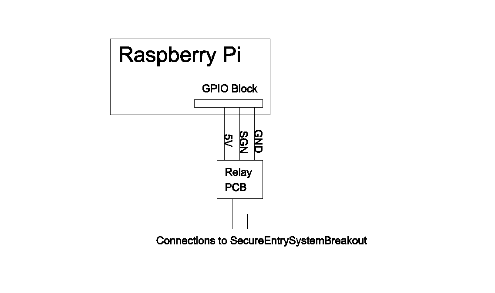

# Doorman Project

## Introduction

The Doorman project was created to allow authorised staff members access to our office without the need for physical keys. Doorman extends the building's existing secure entry system to allow access via a mobile phone. The project consists of three main components:

* a mobile application
* server side application hosted on a Raspberry Pi
* secure entry system breakout

The mobile application is the end-user's interface to the system. Via the application a user can request virtual keys (permanent or temporary) and use those keys to request building access. Versions of the mobile application for both iOS and Android are available.

The server side handles all requests (key and access) from users of the mobile application. Requests for permanent keys are authenticated by the server before the keys are issued. Requests for temporary keys are forwarded to a key granter specified by the requester. Access requests are authenticated and (if successful) will trigger the buildings secure entry system allowing the user access.

A summary of the requests can be seen in the following figure.

The secure entry system breakout bridges the Raspberry Pi and the buildings exisitng secure entry system. This will be discussed in more detail later.

## Building the system

### Software build

As part of the software build you will need some build configuration files. These files set up Doorman so that it is specific to your use case. The configuration files required are:

* Golgi.DevKey
* Golgi.AppKey
* Doorman.thrift
* Doorman.conf

**Golgi.DevKey:** contains your Golgi Developer key associated with your Golgi account. You can view it on the Golgi Developer portal.

**Golgi.AppKey:** contains your Golgi Application key associated with your Doorman application. You can create an application key on the Golgi Developer portal. 

**Doorman.thrift:** contains your Doorman Golgi definitions. This file is included in the Git repo and does not require modification.

**Doorman.conf:** contains configuration for your Doorman build. The Doorman.conf file is described in more detail in the next section. 

#### Doorman.conf configuration items

There are five items that are required in your Doorman.conf file. They are listed below. The Doorman.conf file is used in both the mobile and server side builds - *it is crucial that all builds contain the same configuration settings*.

**ADDR**: contains the address of the key granter that issues permanent keys. Doorman allows the use of both permanent and temporary (single day) keys. Which key type a user requests is controlled by the address they request it from. If the address of a permanent key holder is used a temporary key will be issued. If the address in the Doorman.address file is used (and the user authenticates properly) a permanent key will be issued.

**PIN:** contains the pin required when requesting a permanent key. The user will be prompted for the pin when requesting the permanent key. *This pin should be kept secret and only shared with users who are authorised to have permanent keys*.

**MYSQL_PWD:** contains the password for the Doorman MySQL user on the Raspberry Pi. The user will be created with this passowrd and will be used by the server to access the MySQL database.

**LAT:** contains the latitude of the point of access (your door) that Doorman will control.

**LON:** contains the longitude of the point of access (your door) that Doorman will control.

#### Mobile software builds

The Android code can be built on any machine with Android Studio. Like all iOS applications the iOS code must be built on OS X using Xcode.

#### Raspberry Pi software builds

The server side code should be built directly on your Raspberry Pi. This allows the installation scripts to install libarary dependencies required for the project. *Ensure that the Doorman.conf file for this build is consistent with your mobile builds*. The server side build commands are as follows:

sudo apt-get update
sudo apt-get install mysql-server
cd /path/to/Doorman/Server

echo PASSWORD > Doorman.mysql.passwd # substitute password of choice for PASSWORD
echo PIN > Doorman.pin # substitute pin of choice for PIN
echo ADDR > Doorman.address # substitute address of choice for ADDR

sh scripts/setupMySQL.sh

mysql -u root -p < scripts/createMySQLDatabase.sql # use root MySQL password
mysql -u root -p < scripts/createMySQLUser.sql # use root MySQL password

make all
sudo make install

Once complete you can check if Doorman is successfully running on your system with the command

service doorman status

and by checking the logging output in /opt/doorman/log.

### Hardware build

**Note:** Please take extreme care when dealing with your buildings secure entry system. The voltages and currents carried by the systems can vary and may be high enough to cause serious injury or death. If you are at all unsure about wiring into such a system please seek help from a professional.

Building the hardware requires breaking out the buildings existing secure entry system. The following figure shows an example of a secure entry system. 

The main point of interest to a Doorman project is the "Door Access Loop". This loop controls the secure locking mechanism. The loop is a normally open circuit. When the circuit is open current can't flow and the door lock is engaged. When the switch is closed, the circuit is completed, current can flow and the door lock releases - this switch is ususally part of an internal phone used to communicate with individuals at the external intercom.

To control this access loop from the Raspberry Pi a relay is wired in parallel with the switch. With this wiring when the relay is closed the door lock releases.

The following figure shows how the relay can be wired into the Raspberry Pi. Note that the relay is labelled "Relay PCB" - PCB stands for printed circuit board. The Relay PCB is actually a relay mounted on a PCB along with some resistors, a transistor, a diode and an LED. The additional components on the board provide (along with other things) protection for the Raspberry Pi from back EMF from the relay. 

It is strongly recommended to pick up a pre-designed Relay and PCB. They are incredibly cheap and worth it to ensure the Raspberry Pi is protected. I used the [Beefcake Relay Control Kit](https://www.sparkfun.com/products/11042) from Sparkfun. You'll notice it has more than enough capacity to handle what a typical Doorman project requires. However, at such a low cost this spare capacity is definitely worth it.

